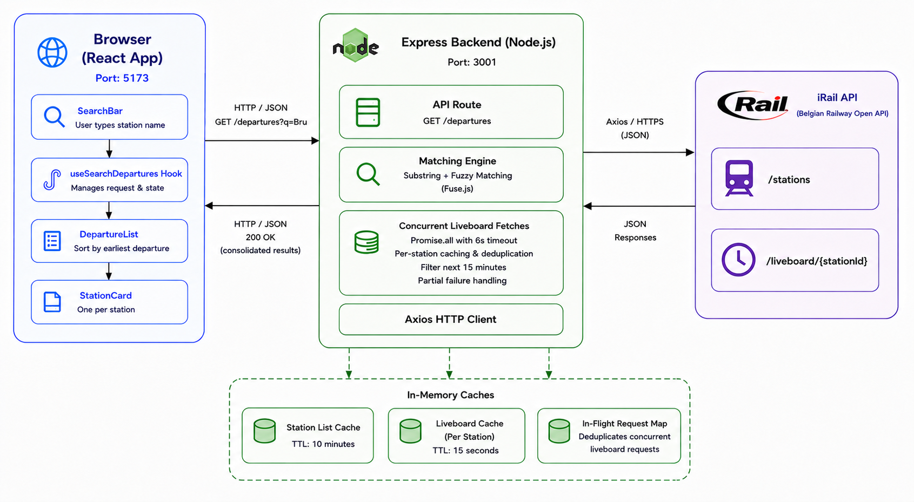
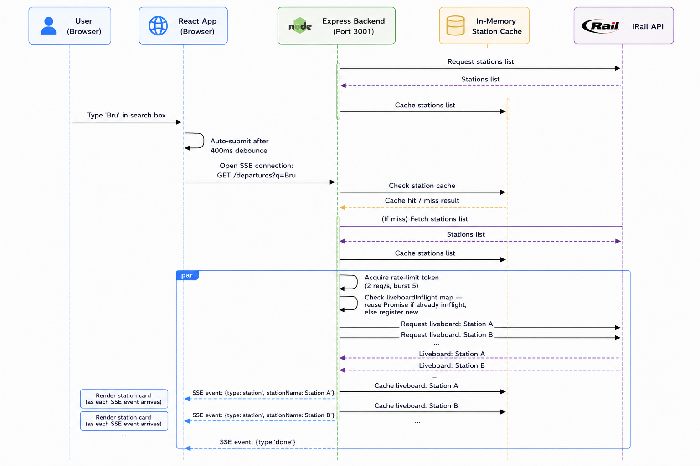

# Lagovia Train Tracker

A live train departure board that searches Belgian stations by name and shows upcoming departures within the next 15 minutes. Data is sourced from [iRail](https://docs.irail.be/), the open Belgian railway API.

---

## How to Install and Run

### Prerequisites
- Node.js ≥ 18 (`node -v` to check)
- npm ≥ 9

### Install dependencies

```bash
# From the project root:
npm install            # installs concurrently for the root dev script
npm run install:all    # installs backend and frontend dependencies
```

### Run

```bash
# From the project root — starts both backend and frontend:
npm run dev
```

Once the servers are up and running, open `http://localhost:5173` to access the demo. 

---

## API Reference

### `GET /departures?q=<query>`

Returns upcoming departures (next 15 minutes) from every station whose name contains `<query>` as a substring, with fuzzy fallback for typos.

**Query constraints:**
- Fewer than 3 characters → `400 QUERY_TOO_SHORT`
- More than 100 characters → `400 QUERY_TOO_LONG`
- Cannot reach iRail → `502 UPSTREAM_ERROR`

**Success response (`200 OK`):**
```json
{
  "query": "Bru",
  "generatedAt": "2024-01-15T14:32:00.000Z",
  "stations": [
    {
      "stationId": "BE.NMBS.008814001",
      "stationName": "Brussels-Central",
      "departures": [
        {
          "trainNumber": "IC3033",
          "destination": "Liège-Guillemins",
          "scheduledTime": "14:35",
          "scheduledTimestamp": 1705329300,
          "delayMinutes": 5,
          "cancelled": false,
          "platform": "3"
        }
      ]
    },
    {
      "stationId": "BE.NMBS.008821006",
      "stationName": "Brussels-North",
      "departures": [],
      "fetchError": "Could not load departures for this station"
    }
  ]
}
```

**Error responses:**
```json
{ "error": "Input is incomplete", "code": "QUERY_TOO_SHORT" }
{ "error": "Query is too long", "code": "QUERY_TOO_LONG" }
{ "error": "Failed to reach the iRail upstream API", "code": "UPSTREAM_ERROR" }
```

---


## Architecture



The app uses the following frameworks for each of the components.

| Component                        | Framework / Library             |
|----------------------------------|---------------------------------|
| Frontend UI                      | React                           |
| Frontend build & dev server      | Vite                            |
| Styling                          | Tailwind CSS                    |
| Icons                            | Lucide React                    |
| Backend server                   | Express                         |
| HTTP client                      | Axios                           |
| Fuzzy search                     | Fuse.js                         |
| Tests                            | Vitest + Supertest              |

### Sequence Diagram


1. Express backend prefetches the list of stations and caches them in memory for 10 minutes.
2. User types and submits a query in the browser.
3. React hook fires GET /departures?q=Bru to Express.
4. Using the cached stations list, Express finds the list of stations that contain the query in their name / standard name.
5. If there are no direct substring matches, Express checks for fuzzy matching.
6. Express fires parallel requests to iRail to fetch the liveboards of each station. 
7. Each liveboard response is cached and filtered. The data is held in cache for 15 seconds. 
8. Each query is checked for duplicate requests. If there are any in flight, the query is held for the result and is not fired.
9. All the responses of all the requests are consolidated into a JSON. Any failures in upstream are handled separately and are denoted in the response accordingly.
10. Once Frontend receives the response, each station's data is rendered in a separate card.
11. Each departures of each station are sorted according to their departure times. The station cards themselves are sorted according to their earliest departures, and then alphabetically. Stations with no departures are shown at the bottom.
12. After 15 seconds, the Refresh button appears to allow the user to fetch fresh data.
13. On clearing the search box, the previous results disappear and the app is ready for a new query.

## Decisions and Tradeoffs

### Caching strategy

1. The full station list (~714 entries) is prefetched by the Express backend from iRail and cached in memory for 10 minutes. 
- Since this is a prerequisite that rarely changes for any user query, the slight tradeoff of prefetching and caching should essentially be ignored.

2. When a user submits a query, the liveboard of every matching station is fetched in parallel and cached in memory for 15 seconds.
- This keeps the backend from hitting the iRail API repeatedly and prevents redundant information. 
- Since the departure time is expressed in HH:MM, a TTL of 15 seconds keeps data reasonably fresh.
- A periodic interval job that runs every 15 seconds removes all the stale entries in cache.

### Parallel liveboard fetches with `Promise.all`

Rather than fetching liveboards from iRail sequentially, we launch all liveboard requests concurrently with `Promise.all`. 
- Each per-station fetch is wrapped in its own `try/catch`, so a single station failure never rejects the outer `Promise.all` — the UI shows a per-station error note for failures while still displaying results for all other stations.
- While iRail does mention [API rate limits](https://docs.irail.be/#header-request-limits) in their documentation, practically the server never threw a 429 status. After verifying this by firing 100+ requests per second multiple times, the decision to fire all requests in parallel was made.

### Display actual upcoming departures, not scheduled

Departures are filtered by **actual** time (not scheduled) by taking the delay into account. Thus, trains that are scheduled to leave before the time right now but have not left because of a delay will be displayed. Trains that already departed are excluded regardless of their scheduled or actual time.

### Bonus - Fuzzy search

Substring matching satisfies the spec. Fuzzy matching (bonus requirement) is layered on top using [Fuse.js](https://fusejs.io/): results that don't match by substring are checked against a fuzzy index and appended. The threshold (0.35) was chosen to catch common typos without producing wildly irrelevant results.

### Known Limitations

- **No rate-limit handling:** iRail [documents](https://docs.irail.be/#header-request-limits) rate limits (3 req/s, burst of 5) but does not enforce them in practice. Thus, the backend makes all liveboard requests concurrently with no rate limiting. If limits were enforced, the Express backend will return a 502 UPSTREAM_ERROR.
- **Time zone assumption:** Scheduled times are formatted in `Europe/Brussels`. If iRail ever returns timestamps in a different zone, this would show incorrect times.
- **Sophisticated Error Handling:** The app does not handle each error as required (such as waiting and retrying on 502, waiting on 429, etc.). Instead, a generic error message is thrown to the frontend to notify the user. 
- **No defensive validation of upstream data:** The application treats iRail as a trusted API and assumes documented response fields and reasonable payload sizes. It does not implement defensive measures such as maximum station name lengths, maximum station counts, or schema validation of upstream responses.

## Alternative Approach

The `main` branch is my official submission and intentionally follows the requirements of the assessment as closely as possible.

As an alternative, I also implemented a version on the `my_version` branch that uses **Server-Sent Events (SSE)** to progressively stream results to the frontend instead of waiting for a complete response.

While this introduces slightly more implementation complexity, I believe it is a more production-oriented design. Progressive rendering improves perceived responsiveness for larger searches, and the backend can naturally pace requests to the iRail API, respecting the documented rate limits and reducing the risk of being rate-limited or blocked if those limits are enforced in the future.

I chose not to submit this version as the primary implementation because the assessment explicitly requests a single JSON endpoint, and I wanted the official submission to align as closely as possible with the stated requirements.
